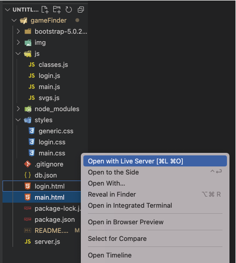

# **AltimetrikGameFinderApp**

## HOW TO RUN THE APP

Start Json server / Json server auth:

```
npx json-server db.json -m ./node_modules/json-server-auth
```

Accepted users:

```
{
  "email": "test@mail.com",
  "password": "hola"
}
```

Open gameFinder folder in visual Studio Code, and run login.html in live server.



## BACKLOG

- ~~Create login screen view~~
- ~~Add functionality to it~~
- ~~Validate the users before sending info to server~~
- ~~Show snackbars for success and errors~~
- ~~Make login carousel functional~~
- ~~Create card list w/ three columns (responsive)~~
- ~~Create card list w/ one column (responsive)~~
- ~~Create header & searchbar (responsive)~~
- ~~Create sidebar (responsive)~~
- ~~Make vertical display functional~~
- ~~Connect w/ rawg.io API~~
- ~~Functionality for search & search suggestions~~
- ~~Please refactor~~

## NICE TO HAVE

- Last searches
